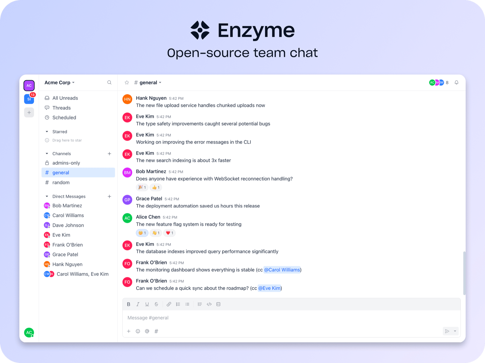

<p align="center">
  <picture>
    <source media="(prefers-color-scheme: dark)" srcset=".github/readme-banner-dark.png" />
    <source media="(prefers-color-scheme: light)" srcset=".github/readme-banner-light.png" />
    
  </picture>
</p>

<p align="center">
  <a href="https://enzyme.chat">Website</a> ·
  <a href="#documentation">Documentation</a> ·
  <a href="docs/self-hosting.md">Self-Hosting</a> ·
  <a href="CONTRIBUTING.md">Contributing</a>
</p>

## Features

- **Channels** — Public, private, and group conversations to keep things organized
- **Threads** — Keep discussions focused with threaded replies
- **Direct messages** — Private 1:1 and group conversations
- **Reactions** — Emoji reactions on any message
- **Presence** — See who's online with real-time status and typing indicators
- **File uploads** — Share files and images directly in conversations
- **Roles & permissions** — Owner, admin, member, and guest roles per workspace
- **Real-time** — Instant updates powered by Server-Sent Events
- **Dark mode** — Full dark mode support
- **Desktop app** — Native Electron app for macOS, Windows, and Linux
- **Single binary** — Deploy a single binary with the web client embedded

## Why Enzyme?

Enzyme is fully open-source (not just open-core), self-hostable, and designed to feel familiar to anyone who's used Slack. You own your data, you own your instance, and the license guarantees that won't change.

For a detailed comparison with other options, see [Alternatives](docs/alternatives.md).

## Quick Start

Download the latest release and run it — that's it.

```bash
curl -LO https://github.com/enzyme/enzyme/releases/latest/download/enzyme-linux-amd64
chmod +x enzyme-linux-amd64
./enzyme-linux-amd64
```

The server starts on `http://localhost:8080` and serves both the API and web client. See the [self-hosting guide](docs/self-hosting.md) for production deployment with TLS and systemd.

## Configuration

Enzyme is configured via config file, environment variables, or CLI flags. See the [configuration guide](docs/configuration.md) for all available options.

## Documentation

| Guide            | Description                             |
| ---------------- | --------------------------------------- |
| [Self-Hosting]   | Deploy Enzyme on your own server        |
| [Configuration]  | All configuration options               |
| [Permissions]    | Roles, permissions, and access control  |
| [Administration] | Workspace administration                |
| [Scaling]        | Performance tuning and scaling          |
| [Security]       | Security model and best practices       |
| [Notifications]  | Notification preferences and behavior   |
| [Messages]       | Message formatting and features         |
| [API]            | Go backend architecture and development |
| [Web]            | React frontend architecture             |

[Self-Hosting]: docs/self-hosting.md
[Configuration]: docs/configuration.md
[Permissions]: docs/permissions.md
[Administration]: docs/administration.md
[Scaling]: docs/scaling.md
[Security]: docs/security.md
[Notifications]: docs/notifications.md
[Messages]: docs/messages.md
[API]: api/README.md
[Web]: apps/web/README.md

## Contributing

Contributions are welcome! Whether it's bug reports, feature requests, or pull requests — all help is appreciated. See the [contributing guide](CONTRIBUTING.md) for development setup and workflow.

## License

MIT — see [LICENSE](LICENSE) for details.
