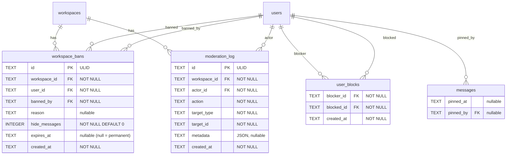

# feat: Add Moderation Tools

## Overview

Add a comprehensive moderation suite to Enzyme covering four areas: workspace user banning (permanent + temporary), message pinning, personal user blocking (invisible soft block), and a moderation audit log. This gives workspace admins the tools to manage disruptive behavior and gives individual users control over who can contact them.

See brainstorm: `docs/brainstorms/2026-02-25-moderation-tools-brainstorm.md` for full decision rationale.

## Problem Statement / Motivation

Enzyme currently has no moderation tools beyond message deletion and member removal. Workspace admins cannot ban disruptive users (who can immediately rejoin via invite links), users cannot block others from DMing them, important messages cannot be pinned for reference, and there is no audit trail of admin actions. These are table-stakes features for any team messaging app.

## Proposed Solution

A single `api/internal/moderation/` package owns bans, blocks, and the audit log. Message pinning lives in the existing `message` domain (two columns on an existing table). This was chosen over separate packages (too much wiring) and extending existing packages (scatters moderation logic). See brainstorm for alternatives considered.

## Technical Approach

### Architecture

```
api/internal/
├── moderation/
│   ├── model.go          # Ban, Block, AuditLogEntry structs + constants
│   └── repository.go     # Ban CRUD, Block CRUD, AuditLog insert/query
├── message/
│   ├── model.go          # Add SystemEventMessagePinned/Unpinned constants
│   └── repository.go     # Add Pin/Unpin/ListPinned methods + block/ban filters
├── handler/
│   ├── moderation.go     # Ban, unban, block, unblock, audit log handlers
│   └── message.go        # Pin/unpin handlers (extend existing file)
├── sse/
│   ├── events.go         # Add new event type constants
│   └── hub.go            # Add DisconnectUserClients method
├── workspace/
│   └── model.go          # Add CanModerate() helper (alias for CanManageMembers)
└── app/
    └── app.go            # Wire moderation repository
```

### Data Model (ERD)



### Implementation Phases

#### Phase 1: Database Migrations + Domain Package

**Migration `035_add_message_pinning.sql`**

```sql
-- +goose Up
ALTER TABLE messages ADD COLUMN pinned_at TEXT;
ALTER TABLE messages ADD COLUMN pinned_by TEXT REFERENCES users(id) ON DELETE SET NULL;
CREATE INDEX idx_messages_pinned ON messages(channel_id, pinned_at) WHERE pinned_at IS NOT NULL;

-- +goose Down
ALTER TABLE messages DROP COLUMN pinned_by;
ALTER TABLE messages DROP COLUMN pinned_at;
```

**Migration `036_create_workspace_bans.sql`**

```sql
-- +goose Up
CREATE TABLE workspace_bans (
    id TEXT PRIMARY KEY,
    workspace_id TEXT NOT NULL REFERENCES workspaces(id) ON DELETE CASCADE,
    user_id TEXT NOT NULL REFERENCES users(id) ON DELETE CASCADE,
    banned_by TEXT NOT NULL REFERENCES users(id) ON DELETE CASCADE,
    reason TEXT,
    hide_messages INTEGER NOT NULL DEFAULT 0,
    expires_at TEXT,
    created_at TEXT NOT NULL DEFAULT (strftime('%Y-%m-%dT%H:%M:%SZ', 'now')),
    UNIQUE(workspace_id, user_id)
);
CREATE INDEX idx_workspace_bans_workspace ON workspace_bans(workspace_id);
CREATE INDEX idx_workspace_bans_user ON workspace_bans(user_id);

-- +goose Down
DROP TABLE workspace_bans;
```

**Migration `037_create_user_blocks.sql`**

```sql
-- +goose Up
CREATE TABLE user_blocks (
    blocker_id TEXT NOT NULL REFERENCES users(id) ON DELETE CASCADE,
    blocked_id TEXT NOT NULL REFERENCES users(id) ON DELETE CASCADE,
    created_at TEXT NOT NULL DEFAULT (strftime('%Y-%m-%dT%H:%M:%SZ', 'now')),
    PRIMARY KEY (blocker_id, blocked_id)
);
CREATE INDEX idx_user_blocks_blocker ON user_blocks(blocker_id);
CREATE INDEX idx_user_blocks_blocked ON user_blocks(blocked_id);

-- +goose Down
DROP TABLE user_blocks;
```

**Migration `038_create_moderation_log.sql`**

```sql
-- +goose Up
CREATE TABLE moderation_log (
    id TEXT PRIMARY KEY,
    workspace_id TEXT NOT NULL REFERENCES workspaces(id) ON DELETE CASCADE,
    actor_id TEXT NOT NULL REFERENCES users(id) ON DELETE CASCADE,
    action TEXT NOT NULL CHECK (action IN (
        'user.banned', 'user.unbanned',
        'message.deleted', 'member.removed',
        'member.role_changed', 'channel.archived'
    )),
    target_type TEXT NOT NULL CHECK (target_type IN ('user', 'message', 'channel')),
    target_id TEXT NOT NULL,
    metadata TEXT,
    created_at TEXT NOT NULL DEFAULT (strftime('%Y-%m-%dT%H:%M:%SZ', 'now'))
);
CREATE INDEX idx_moderation_log_workspace ON moderation_log(workspace_id, created_at);

-- +goose Down
DROP TABLE moderation_log;
```

**New files:**

- `api/internal/moderation/model.go` — Ban, Block, AuditLogEntry structs, action/target type constants
- `api/internal/moderation/repository.go` — NewRepository, all CRUD methods

**Modify:**

- `api/internal/app/app.go` — Wire `moderation.NewRepository(db.DB)`
- `api/internal/handler/handler.go` — Add `moderationRepo *moderation.Repository` to Handler + Dependencies

---

#### Phase 2: Message Pinning (Backend + Frontend)

**Backend — OpenAPI spec additions (`api/openapi.yaml`):**

New endpoints (all POST, following codebase convention):

- `POST /workspaces/{wid}/channels/{id}/messages/{mid}/pin` — Pin a message
- `POST /workspaces/{wid}/channels/{id}/messages/{mid}/unpin` — Unpin a message
- `POST /workspaces/{wid}/channels/{id}/pins/list` — List pinned messages (paginated)

New SSE event types: `message.pinned`, `message.unpinned`

New system event types: `SystemEventMessagePinned`, `SystemEventMessageUnpinned`

**Backend — Handler logic (`api/internal/handler/message.go`):**

`PinMessage`:
1. Auth check
2. Fetch message, verify it belongs to the channel
3. Reject if message is deleted (`deleted_at IS NOT NULL`)
4. Check channel membership — user must be able to post (`channel.CanPost`)
5. Workspace admins can pin in public channels without membership (matches post permissions)
6. Check pin count: `SELECT COUNT(*) FROM messages WHERE channel_id = ? AND pinned_at IS NOT NULL` — reject if >= 50
7. Pin the message (set `pinned_at`, `pinned_by`) in a transaction with the count check
8. Create system message: "Alice pinned a message" with `SystemEventData{MessageID: mid}`
9. Broadcast `message.pinned` SSE event to channel

`UnpinMessage`:
1. Same auth/permission checks as pin
2. Clear `pinned_at` and `pinned_by`
3. Create system message: "Alice unpinned a message"
4. Broadcast `message.unpinned` SSE event to channel

`ListPinnedMessages`:
1. Auth check, verify channel membership
2. Query messages where `pinned_at IS NOT NULL AND channel_id = ?`, ordered by `pinned_at DESC`
3. Return full `MessageWithUser` objects (matches existing `ListMessages` format)
4. Apply block list filter (blocked user messages hidden from pinned list)

**Backend — Message model additions (`api/internal/message/model.go`):**

```go
const (
    SystemEventMessagePinned   = "message_pinned"
    SystemEventMessageUnpinned = "message_unpinned"
)
```

Extend `SystemEventData` with `MessageID string` field (optional, used for pin events).

**Backend — Message repository additions (`api/internal/message/repository.go`):**

- `PinMessage(ctx, messageID, userID string) error` — set `pinned_at`/`pinned_by`
- `UnpinMessage(ctx, messageID string) error` — clear `pinned_at`/`pinned_by`
- `ListPinnedMessages(ctx, channelID string, opts ListOptions) ([]MessageWithUser, bool, string, error)` — paginated
- `CountPinnedMessages(ctx, channelID string) (int, error)` — for limit enforcement

**Frontend:**

- `apps/web/src/api/messages.ts` — Add `pinMessage`, `unpinMessage`, `listPinnedMessages` API functions
- `apps/web/src/hooks/useMessages.ts` — Add `usePinMessage`, `useUnpinMessage`, `usePinnedMessages` hooks
- `apps/web/src/hooks/useSSE.ts` — Handle `message.pinned` and `message.unpinned` events (update message in cache, invalidate pinned list)
- `apps/web/src/components/` — Pin button on message hover menu, pinned messages panel (slide-out, similar to thread panel)

---

#### Phase 3: User Banning (Backend + Frontend)

**Backend — OpenAPI spec additions:**

New endpoints:

- `POST /workspaces/{wid}/bans/create` — Ban a user
- `POST /workspaces/{wid}/bans/remove` — Unban a user
- `POST /workspaces/{wid}/bans/list` — List active bans (paginated, admin+)

Request schema for ban:
```yaml
BanUserRequest:
  type: object
  required: [user_id]
  properties:
    user_id:
      type: string
    reason:
      type: string
    hide_messages:
      type: boolean
      default: false
    duration_hours:
      type: integer
      description: "Hours until ban expires. Omit for permanent."
```

New SSE events: `member.banned`, `member.unbanned`

**Backend — SSE hub changes (`api/internal/sse/hub.go`):**

Add `DisconnectUserClients(workspaceID, userID string)` method that:
1. Iterates the workspace's connected clients
2. For each client belonging to the target user, closes their `Done` channel
3. This causes the SSE handler's `select` loop to return, closing the connection

**Backend — Handler logic (`api/internal/handler/moderation.go`):**

`BanUser`:
1. Auth check
2. Check workspace membership — actor must be admin+ (`workspace.CanManageMembers`)
3. **Role hierarchy enforcement**: Actor can only ban users with strictly lower `RoleRank()`. Owner can never be banned. Self-ban rejected.
4. Check target is a workspace member
5. Check target is not already banned (`UNIQUE` constraint handles this, return conflict)
6. Calculate `expires_at` from `duration_hours` (if provided), all timestamps UTC
7. In a single transaction:
   a. Create `workspace_bans` record
   b. Remove workspace membership (`workspaceRepo.RemoveMember`)
   c. Remove all channel memberships for user in this workspace (except DM channels — preserve DM memberships for history access)
   d. Update SSE hub: call `hub.RemoveChannelMember` for each removed channel membership
8. Disconnect user's SSE clients: `hub.DisconnectUserClients(workspaceID, userID)`
9. Create audit log entry (action: `user.banned`, metadata: reason, duration, hide_messages)
10. Broadcast `member.banned` SSE event to workspace

`UnbanUser`:
1. Auth check, admin+ permission
2. Find active ban record
3. Delete the ban record
4. Create audit log entry (action: `user.unbanned`)
5. Broadcast `member.unbanned` SSE event to workspace
6. Note: The user must rejoin via a new invite. Unbanning does not auto-restore membership.

`ListBans`:
1. Auth check, admin+ permission
2. Query `workspace_bans` where `expires_at IS NULL OR expires_at > datetime('now')`
3. Return with user display info (JOIN to users table)
4. Opportunistic cleanup: delete expired rows encountered during query (optional)

**Ban enforcement touchpoints (modify existing code):**

These existing handlers/repositories need a ban check:

| Location | Change |
|---|---|
| `handler/workspace.go` — `AcceptInvite` | Check for active ban before allowing join |
| `handler/channel.go` — `JoinChannel` | Check for active ban before allowing public channel join |
| `message/repository.go` — `List` | Filter messages from banned users with `hide_messages=1` |
| `message/repository.go` — `ListThread` | Same filter |
| `message/repository.go` — `ListAllUnreads` | Same filter |
| `message/repository.go` — `Search` | Same filter (including FTS join) |
| `message/repository.go` — `getReactionsForMessages` | Filter reactions from hidden banned users |
| `message/repository.go` — `getThreadParticipantsForMessages` | Filter thread participants from hidden banned users |

**Message hiding SQL fragment** (used in all message queries):

```sql
AND m.user_id NOT IN (
    SELECT wb.user_id FROM workspace_bans wb
    WHERE wb.workspace_id = ? AND wb.hide_messages = 1
    AND (wb.expires_at IS NULL OR wb.expires_at > strftime('%Y-%m-%dT%H:%M:%SZ', 'now'))
)
```

**DM channel behavior on ban:** DM channel memberships are preserved. The banned user cannot access the workspace, so DMs are naturally inaccessible to them. The other participant retains read access to conversation history.

**Frontend:**

- `apps/web/src/api/moderation.ts` — New file: `banUser`, `unbanUser`, `listBans` API functions
- `apps/web/src/hooks/useModeration.ts` — New file: `useBanUser`, `useUnbanUser`, `useBans` hooks
- `apps/web/src/hooks/useSSE.ts` — Handle `member.banned` (remove user from member list cache, show toast) and `member.unbanned` events
- `apps/web/src/components/` — Ban dialog (reason, duration picker, hide messages checkbox), ban management panel in workspace settings

---

#### Phase 4: User Blocking (Backend + Frontend)

**Backend — OpenAPI spec additions:**

New endpoints (under `/users/` since blocks are per-user, not per-workspace):

- `POST /users/blocks/create` — Block a user
- `POST /users/blocks/remove` — Unblock a user
- `POST /users/blocks/list` — List your blocked users

No SSE events (blocking is private).

**Backend — Handler logic (`api/internal/handler/moderation.go`):**

`BlockUser`:
1. Auth check
2. Validate target user exists
3. Prevent self-block
4. Insert into `user_blocks` (UNIQUE constraint handles duplicate — return success idempotently)
5. No SSE broadcast, no audit log (personal action, not a moderation action)

`UnblockUser`:
1. Auth check
2. Delete from `user_blocks`
3. Return success (idempotent — if not blocked, still 200)

`ListBlocks`:
1. Auth check
2. Query `user_blocks WHERE blocker_id = ?`, join to users for display info

**Block enforcement touchpoints (modify existing code):**

| Location | Change |
|---|---|
| `message/repository.go` — `List` | Add `NOT IN (SELECT blocked_id FROM user_blocks WHERE blocker_id = ?)` filter |
| `message/repository.go` — `ListThread` | Same filter |
| `message/repository.go` — `ListAllUnreads` | Same filter |
| `message/repository.go` — `Search` | Same filter |
| `message/repository.go` — `getReactionsForMessages` | Filter reactions from blocked users |
| `message/repository.go` — `getThreadParticipantsForMessages` | Filter blocked user participants |
| `handler/message.go` — `SendMessage` | Strip @mentions of blocked/blocking users from parsed mentions |
| `handler/channel.go` — `CreateChannel` (DM creation) | Prevent DM creation if either user has blocked the other |
| `handler/channel.go` — `AddChannelMember` (DM/group DM) | Prevent adding blocker to DM with blocked user |
| SSE broadcast — DM messages | Server-side: skip SSE delivery to blocker for DMs from blocked users |
| SSE broadcast — Channel messages | Client-side: filter blocked user messages on render (acceptable for non-DM channels) |

**Message filtering SQL fragment** (combined with ban filter):

```sql
AND m.user_id NOT IN (
    SELECT blocked_id FROM user_blocks WHERE blocker_id = ?
)
```

Both the ban-hide and block filters are applied together in message queries. The calling handler passes the requesting user's ID and workspace ID to the repository.

**Phantom DM delivery (soft block):**

When a blocked user sends a DM:
1. The message IS stored in the database normally (the blocked user sees it in their view)
2. The SSE `message.new` event is NOT delivered to the blocker (server-side filter for DM channels)
3. When the blocker queries messages, the blocked user's messages are filtered out
4. If the blocker later unblocks, all historical messages become visible

**Frontend:**

- `apps/web/src/api/moderation.ts` — Add `blockUser`, `unblockUser`, `listBlocks` API functions
- `apps/web/src/hooks/useModeration.ts` — Add `useBlockUser`, `useUnblockUser`, `useBlocks` hooks
- Client-side message filtering: In the message list component, filter out messages from blocked users (supplement server-side filtering for SSE-delivered messages)
- Block/unblock action in user profile panel and member list context menu
- DM compose area: disable input when viewing a DM with a user you've blocked

---

#### Phase 5: Moderation Audit Log (Backend + Frontend)

**Backend — OpenAPI spec additions:**

- `POST /workspaces/{wid}/moderation-log/list` — List audit log entries (paginated, admin+)

Response includes: `entries[]` with `id`, `actor` (user object), `action`, `target_type`, `target_id`, `metadata`, `created_at`, plus `has_more` and `next_cursor`.

**Backend — Handler logic (`api/internal/handler/moderation.go`):**

`ListModerationLog`:
1. Auth check, admin+ permission
2. Cursor-based pagination (ULID cursor, matching message list pattern)
3. Join to users table for actor display name/avatar
4. Return entries ordered by `created_at DESC`

**Backend — Audit log integration into existing handlers:**

These existing handlers need audit log writes added:

| Handler | Action | What to log in metadata |
|---|---|---|
| `handler/moderation.go` — `BanUser` | `user.banned` | reason, duration_hours, hide_messages |
| `handler/moderation.go` — `UnbanUser` | `user.unbanned` | — |
| `handler/message.go` — `DeleteMessage` | `message.deleted` | Original message content (captured before soft delete), channel_id. Only when `actor != author`. |
| `handler/workspace.go` — `RemoveWorkspaceMember` | `member.removed` | Only when `actor != target` (not self-removal) |
| `handler/workspace.go` — `UpdateWorkspaceMemberRole` | `member.role_changed` | old_role, new_role |
| `handler/channel.go` — `ArchiveChannel` | `channel.archived` | channel_name |

**Frontend:**

- `apps/web/src/api/moderation.ts` — Add `listModerationLog` API function
- `apps/web/src/hooks/useModeration.ts` — Add `useModerationLog` hook (infinite query with cursor pagination)
- Moderation log page/panel in workspace settings (admin-only), showing a chronological list of admin actions with actor avatars, action descriptions, and metadata

---

#### Phase 6: OpenAPI + Type Regeneration

After all spec changes:

1. Run `cd api && make generate` — regenerates `server.gen.go` with new strict server interface methods
2. Run `make generate-types` — regenerates TypeScript types in `packages/api-client/generated/schema.ts`
3. Export new types from `packages/api-client/src/types.ts`:
   ```typescript
   export type Ban = components['schemas']['Ban'];
   export type Block = components['schemas']['Block'];
   export type ModerationLogEntry = components['schemas']['ModerationLogEntry'];
   ```

Note: Phase 6 runs after each backend phase in practice — generate types as you add endpoints.

## System-Wide Impact

### Interaction Graph

**Ban flow:** `BanUser handler` → `moderation.Repository.CreateBan` + `workspace.Repository.RemoveMember` + `channel.Repository.RemoveAllMembershipsInWorkspace` (new method) → `sse.Hub.RemoveChannelMember` (for each channel) → `sse.Hub.DisconnectUserClients` (new method) → `sse.Hub.BroadcastToWorkspace(member.banned)` → `moderation.Repository.CreateAuditLogEntry`

**Block filter flow:** `ListMessages handler` → `message.Repository.List(ctx, channelID, opts, filterOpts)` → SQL query with `NOT IN (SELECT blocked_id FROM user_blocks WHERE blocker_id = ?)` subquery → results returned with blocked messages excluded

**Pin flow:** `PinMessage handler` → `message.Repository.CountPinnedMessages` + `message.Repository.PinMessage` (in transaction) → `message.Repository.CreateSystemMessage(SystemEventMessagePinned)` → `sse.Hub.BroadcastToChannel(message.pinned)` + `sse.Hub.BroadcastToChannel(message.new)` (for system message)

### Error Propagation

- Ban creation failure: Transaction rolls back, no partial state. Client receives 500.
- Block creation race (duplicate): UNIQUE constraint returns conflict, handler returns 200 (idempotent).
- Pin count race: Transaction serialization (SQLite single-writer) prevents exceeding limit.
- SSE disconnect failure: Non-critical — banned user's connection will timeout on next heartbeat (30s). Log warning.

### State Lifecycle Risks

- **Ban + membership removal atomicity**: Must happen in a single transaction. If membership is removed but ban record fails, user is kicked but not banned (can rejoin). Wrap in `BeginTx`.
- **Message hiding on ban**: Not a state change — it's a query-time filter. No orphaned data risk.
- **Audit log write failure**: Non-critical — the moderation action succeeds, but the log entry is lost. Log error but don't roll back the action.

### API Surface Parity

New endpoints that need OpenAPI definitions, Go handlers, TypeScript types, and frontend hooks:

| Endpoint | Go Handler | TS Hook | SSE Event |
|---|---|---|---|
| Pin message | `PinMessage` | `usePinMessage` | `message.pinned` |
| Unpin message | `UnpinMessage` | `useUnpinMessage` | `message.unpinned` |
| List pins | `ListPinnedMessages` | `usePinnedMessages` | — |
| Ban user | `BanUser` | `useBanUser` | `member.banned` |
| Unban user | `UnbanUser` | `useUnbanUser` | `member.unbanned` |
| List bans | `ListBans` | `useBans` | — |
| Block user | `BlockUser` | `useBlockUser` | — |
| Unblock user | `UnblockUser` | `useUnblockUser` | — |
| List blocks | `ListBlocks` | `useBlocks` | — |
| List audit log | `ListModerationLog` | `useModerationLog` | — |

### Integration Test Scenarios

1. **Ban → rejoin attempt**: Ban a user, then try to accept an invite link with the banned user's token. Expect 403.
2. **Ban with hide messages → message query**: Ban user with `hide_messages=true`, query channel messages as another user. Banned user's messages should not appear. Unban, query again — messages reappear.
3. **Block → DM delivery**: User A blocks User B. User B sends a DM. Verify: message is stored in DB, User A's message list query does not include it, SSE event is not delivered to User A.
4. **Pin at limit**: Pin 50 messages in a channel. Attempt to pin a 51st. Expect 400 error.
5. **Audit log coverage**: Perform a ban, admin message delete, and role change. Query audit log. All three actions should appear with correct metadata.

## Acceptance Criteria

### Functional Requirements

**Banning:**
- [x] Owners can ban admins, members, and guests
- [x] Admins can ban members and guests only
- [x] Owners cannot be banned
- [x] Self-ban is rejected
- [x] Banned users are immediately removed from workspace and all non-DM channels
- [x] Banned users' SSE connections are terminated
- [x] Banned users cannot rejoin via invite links
- [x] Temporary bans expire based on `expires_at` (lazy check on access)
- [x] Admin can choose to hide banned user's messages
- [x] Hidden messages are filtered from all message queries (list, thread, search, unread, pinned)
- [x] Hidden messages' reactions and thread participations are also filtered
- [x] Unbanning removes the ban record; user must rejoin via new invite
- [x] Unbanning with hidden messages restores message visibility automatically
- [x] DM channel memberships preserved on ban (history accessible to other participant)

**Pinning:**
- [x] Any channel member who can post can pin/unpin messages
- [x] Workspace admins can pin in public channels without explicit membership
- [x] Maximum 50 pins per channel, enforced atomically
- [x] Deleted messages cannot be pinned
- [x] System message posted on pin/unpin
- [x] Pinned messages panel shows all pinned messages in a channel
- [x] Pins from banned users (with hidden messages) are filtered from pinned list

**Blocking:**
- [x] Any user can block any other user
- [x] Self-block is rejected
- [x] Blocking is invisible to the blocked user (soft block)
- [x] Blocked user's DM messages are stored but not delivered via SSE to blocker
- [x] Blocked user's messages are hidden from blocker in all channels
- [x] Blocked user's reactions and thread participations are hidden from blocker
- [x] @mentions are stripped in both directions (server-side)
- [x] Blocked user cannot create new DM with blocker
- [x] Blocking is per-user, cross-workspace
- [x] Block/unblock operations are idempotent
- [x] Unblocking restores visibility of all historical messages

**Audit Log:**
- [x] Logs: ban, unban, admin message delete, member removal (not self), role change, channel archive
- [x] Admin message delete captures original message content in metadata
- [x] Visible to workspace owners and admins only
- [x] Cursor-based pagination
- [x] Starts fresh (no backfill)

### Non-Functional Requirements

- [x] All message query modifications use parameterized SQL (no injection risk)
- [x] Ban/block filters add minimal overhead to message queries (subquery, not separate round-trip)
- [x] Pin count enforcement uses transaction to prevent race conditions
- [x] All new endpoints follow existing auth/permission/error patterns
- [x] All timestamps in UTC (RFC3339)

### Quality Gates

- [x] Repository tests for all new CRUD operations (in-memory SQLite)
- [x] Handler tests for permission checks (admin-only, role hierarchy, self-prevention)
- [x] Message query tests verifying ban-hide and block filters work correctly
- [x] SSE event types added to OpenAPI spec and regenerated
- [x] `docs/permissions.md` updated with moderation permissions
- [x] All existing tests continue to pass

## Dependencies & Prerequisites

- No external dependencies — all features use existing SQLite, SSE hub, and auth patterns
- The SSE `Hub.DisconnectUserClients` method must be implemented before ban enforcement works fully
- Message repository filter changes affect many queries — must be done carefully to avoid regressions

## Risk Analysis & Mitigation

| Risk | Impact | Mitigation |
|---|---|---|
| Message query performance degradation from subqueries | Medium | SQLite single-connection model means no contention. Index `user_blocks(blocker_id)` and `workspace_bans(workspace_id, hide_messages)`. Benchmark with seed data. |
| Missing a message query site for ban/block filters | High — messages leak through | Enumerate ALL query sites in repository.go. Add tests that verify filtered messages do not appear. |
| Ban transaction partial failure | High — inconsistent state | Single transaction for ban record + membership removal + channel cleanup. |
| SSE disconnect race with ban | Low | Acceptable 30s window. Banned user can receive events until heartbeat timeout but cannot take actions (membership is already deleted). |

## Documentation Plan

- [x] Update `docs/permissions.md` with moderation permission matrix (who can ban, pin, view audit log)
- [x] Add moderation section to `docs/self-hosting.md` if any configuration options are added (N/A - no config needed)
- [x] Update CLAUDE.md project structure section to include `moderation/` package

## Sources & References

### Origin

- **Brainstorm document:** [docs/brainstorms/2026-02-25-moderation-tools-brainstorm.md](docs/brainstorms/2026-02-25-moderation-tools-brainstorm.md) — Key decisions carried forward: workspace-scoped bans with lazy expiry, invisible soft blocking (DMs + messages + mentions), single moderation package architecture, 50-pin limit, audit log from day one.

### Internal References

- Permission helpers: `api/internal/workspace/model.go:95-115` (CanManageMembers, RoleRank)
- Handler pattern: `api/internal/handler/message.go` (auth → resource → membership → permission → action → SSE)
- Message repository queries: `api/internal/message/repository.go:219` (List), `:451` (ListThread), `:802` (ListAllUnreads), `:974` (Search)
- SSE hub: `api/internal/sse/hub.go` (BroadcastToWorkspace, BroadcastToChannel, BroadcastToUser)
- System messages: `api/internal/message/model.go:18-25` (SystemEvent constants)
- App wiring: `api/internal/app/app.go:84-164`
- Permissions doc: `docs/permissions.md`

### Related Work

- Existing message deletion by admins: `api/internal/handler/message.go:417-468`
- Existing member removal: `api/internal/handler/workspace.go:169-210`
- Existing role change: `api/internal/handler/workspace.go:212-280`
